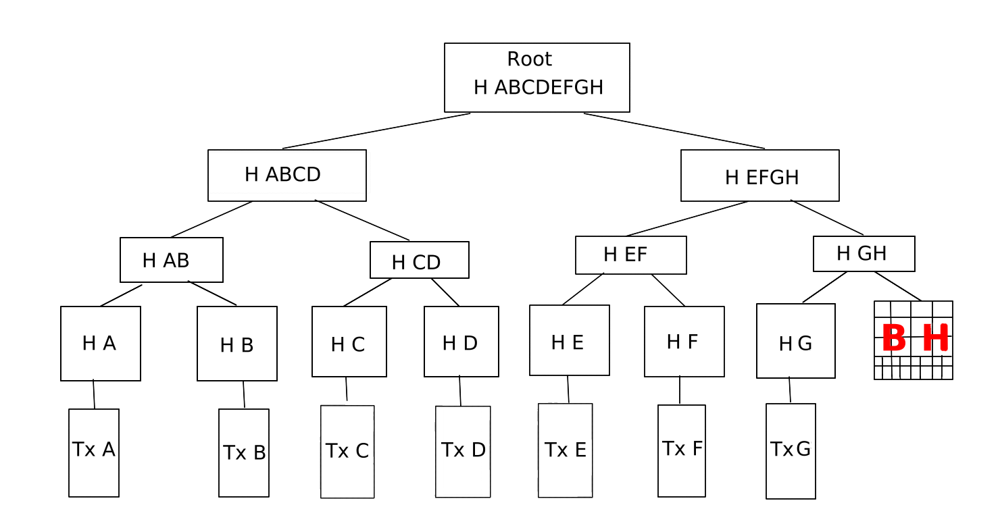

Exercices Distributed Ledger Technology
=========================================

Arbre de merkle avec des blocks impairs ?
-----------------------------------------
### Que faire ?

Celon [Wikipédia](https://fr.wikipedia.org/wiki/Arbre_de_Merkle) il existe un moyen simple de gérer le bloblème de nombre de blocks impairs dans la completion d'un block, est :
> De completer la base (que j'ai illustrée en tant que B H) avec des block vides jusqu'à completer le dernier bock vide et donc "simuler" un block pour que l'arbre de merkle soit **Binaire**.

Comment rejoindre ses pairs sur le réseau ?
-----------------------------------------
### Je viens de rejoindre le réseau bitcoin ça ce passe comment ?

C'est très simple, a partir du moment que tu a créé ta wallet (*ton portefeuille crypto disons*), tu possèdes 2 clées, une **clée privée** qui est *ton mot de passe* que tu ne partage avec personne et une **clée public**, c'est cette clée public qui fera le **lien** avec un pair (*dans le cas ou on devra t'envoyer de l'argent*), si au contraire tu dois envoyer quelqu'on que somme à un autre portefeuille, lui aussi possède une clée public qui serra naicessaire pour le transfert (*comme pour une lettre il faut l'adresse*).

> En résumé, **effectuer quelqu'on que transfert** avec une *clé public* nous lie au réseau.

Qui à influencé le réseau bitcoin et comment ?
-----------------------------------------
### Sans citer les exemples du cours

Voici 3 noms qui pour moi on participé au projet Bitcoin :
* D'après [Wikipédia](https://fr.wikipedia.org/wiki/Bitcoin#Cr%C3%A9ation) le bitcoin serrai une amélioration du concept de b-money imaginé par [Wei Dai](https://en.wikipedia.org/wiki/Wei_Dai) en 1999.
* Et de *bitgold* décrit par [Nick Szado](https://fr.wikipedia.org/wiki/Nick_Szabo) en 2005.
* Pendant sa création il désigna [Gavin Andresen](https://fr.wikipedia.org/wiki/Gavin_Andresen) comme son successeur en lui donnant accès au projet SourceForge.

Dans la blockchain comment lier les blocks entre eux ?
-----------------------------------------
### Avec mes mots :

Un block est un ensemble de données, soit les informations des échanges passés, une information (*un échange, un paiement*) est **euro-daté enregistré**, et il existe 2 fois ce *tiquet*, un pour chaque coté de l'échange, ceux-ci sont aussi lié, serront ainsi hashé et renvoyer au block parent qui les prendront en compte pour faire un total hashé des transaction jusqu'au root.

Le block du **root** étant complet à sa *propre clé*, son *propre résultat* qui serra transféré a son **header**, **ce résultat étant un cumul de toutes les transactions passé** serra donc infalsifiable et *personne ne pourra mentir ou triché* sur son block.

Quelle structure de données représente cette chaine de blocks ?
-----------------------------------------
### Wikipédia

Suite a mes recherches j'ai réussi a trouver dans la [liste des structures de données](https://en.wikipedia.org/wiki/List_of_data_structures), que la sctucture d'une blockchain et notamment celle de *bictoin*, est en [arbre de hachage](https://en.wikipedia.org/wiki/Hash_tree), soit l'**Arbre de Merkle** vue en cours, mais aussi une [base de données disctribuées](https://fr.wikipedia.org/wiki/Base_de_donn%C3%A9es_distribu%C3%A9e#:~:text=En%20informatique%2C%20une%20base%20de,des%20donn%C3%A9es%20de%20mani%C3%A8re%20distribu%C3%A9e.).

Comment modifier une transaction antérieur ?
------------------------------------------
### Et est-ce possible ?

A partir du moment où une transaction à était **signé** par **les deux parties** et donc où nous *possèdons* la trace de ce même échange il nous serra **physiquement impossible de le modifier**.

En effet le block étant **validé** pour faire la transaction à *déjà était validé* et donc **copié par l'entiereté du reseau**, si le *moindre* chiffre change sur un block qui à déjà était validé alors celui ci serra reconnu comme *"traitre"* et pourrait même recevoir des *sanctions lourdes* comme la perte de points de gouvernances ou même directement de la cryptomonanaie avec l'interdiction de pouvoir émettre une transaction dans le futur.

Mais *admettons* qu'un *géni* est venue et m'a offert le net-plus ultrat du PC futuriste *qui n'existe même pas* aujourd'hui et que je sois en mesure de prendre le controle de plus de **51 %** des noeuds du réseau, alors **en théorie** on pourrait corrompre le réseau et acceder a nos notre *fameuse modification*.

        Rédigée par Stella Soler